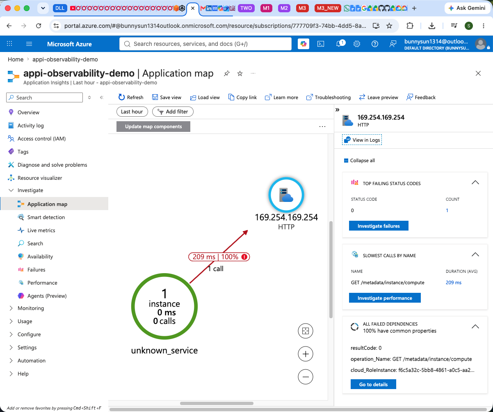

# ❓ 7. Frequently Asked Questions (FAQ) [⬆️ Back to TOC](README.md#toc)

🔹 **Q1. What is Azure Monitor OpenTelemetry Distro?**

Answer: The Azure Monitor OpenTelemetry Distro is a specialized Python library provided by Microsoft. It automatically instruments your Python applications (like Flask or FastAPI) to capture distributed traces, metrics, and logs, and perfectly routes them to Application Insights without requiring heavy manual configuration.

🔹 **Q2. How long does it take for logs to appear in Application Insights?**

Answer: While the "Live Metrics Stream" feature shows telemetry instantly (usually within 1 second), standard logs and traces pushed to the Log Analytics Workspace can sometimes take 2 to 5 minutes to be fully ingested and indexed for querying.

🔹 **Q3. Do I have to deploy my Python app to Azure to use Azure Monitor?**

Answer: No! As demonstrated in this project, you can run the Python app entirely on your local machine. As long as the app has internet access and the correct `APPLICATIONINSIGHTS_CONNECTION_STRING`, it will push telemetry straight to your cloud workspace.

🔹 **Q4. What is an "endpoint"? Are the URLs we are testing considered Azure endpoints?**

Answer: In software, an "endpoint" is simply a specific digital address (URL) where a service can be accessed or where two systems communicate. The endpoints we are hitting in Section 4 (like `http://localhost:8080/error`) are **Local Flask Endpoints**. They are hosted entirely by your own Python application running on your laptop. However, behind the scenes, your Python app captures information about that traffic and sends telemetry directly to an **Azure Ingestion Endpoint** (the URL found in your `.env` connection string) which is securely hosted in the cloud by Microsoft.

🔹 **Q5. So the local Flask endpoints are secretly calling the Azure endpoints? How does that happen without me writing any code for it?**

Answer: Yes, exactly! It works through a concept called **Automatic Instrumentation**. If you look at `app/app.py`, you'll notice there is zero code inside the endpoints (like `def trigger_error():`) that explicitly says "send this data to Azure." 
Because we called `configure_azure_monitor()` at the very top of the script, the OpenTelemetry SDK wraps itself around the entire Flask app like an invisible net. Whenever a user hits your local Flask endpoints, this invisible net automatically detects the HTTP request, measures how long it took, catches any Python exceptions, packages all that metadata up, and fires it off to the Azure Ingestion Endpoint asynchronously in the background!

🔹 **Q6. When I deployed Application Insights, I saw an extra "Action Group" resource get created, but it disappeared on a redeployment and wasn't in the Terraform script. What is that?**

Answer: That resource is the **Application Insights Smart Detection** rule. When you tell Azure to create an Application Insights workspace, Azure's backend often automatically (and invisibly) injects this default Smart Detection Action Group into your Resource Group. It was never in our Terraform script! This auto-generated resource is actually what causes the `terraform destroy` command to crash initially, because Terraform panics when it finds untracked resources in a Resource Group it is trying to delete. Azure's creation of this rule can be inconsistent (sometimes it only appears on the first deployment), but since it is entirely managed by Azure, it doesn't impact our observability testing!

🔹 **Q7. What is the Application Map, and why is there a failure pointing to 169.254.169.254?**

Answer: The Application Map is a visual representation of your application's architecture (a topology graph). It automatically discovers components and maps out how they interact with each other and external services. The size of the circles represents traffic volume, and the colors represent health (errors). 
In your map, you'll see your Flask app (`unknown_service` by default) making a call out to `169.254.169.254`. This specific IP address is the Azure Instance Metadata Service (IMDS). Because the OpenTelemetry SDK is designed for the cloud, the moment you run the app, the SDK automatically pings that IP address to check if it is running inside an Azure Virtual Machine. Because you are actually running the app locally on your macOS laptop (and not in an Azure VM), that IP address fails to respond, which is why it shows up as a 100% failure rate dependency!

