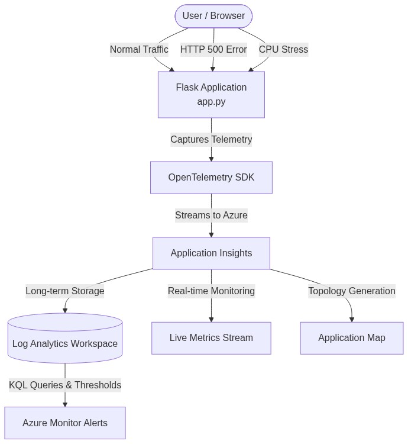
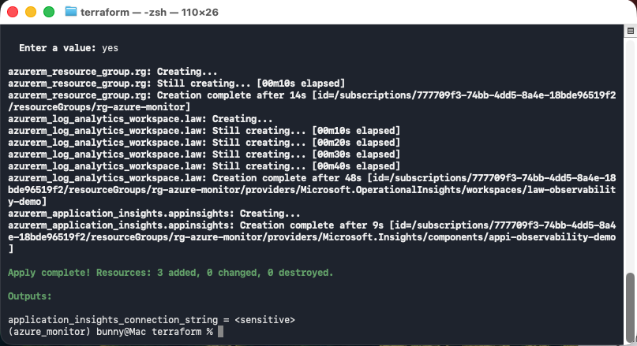
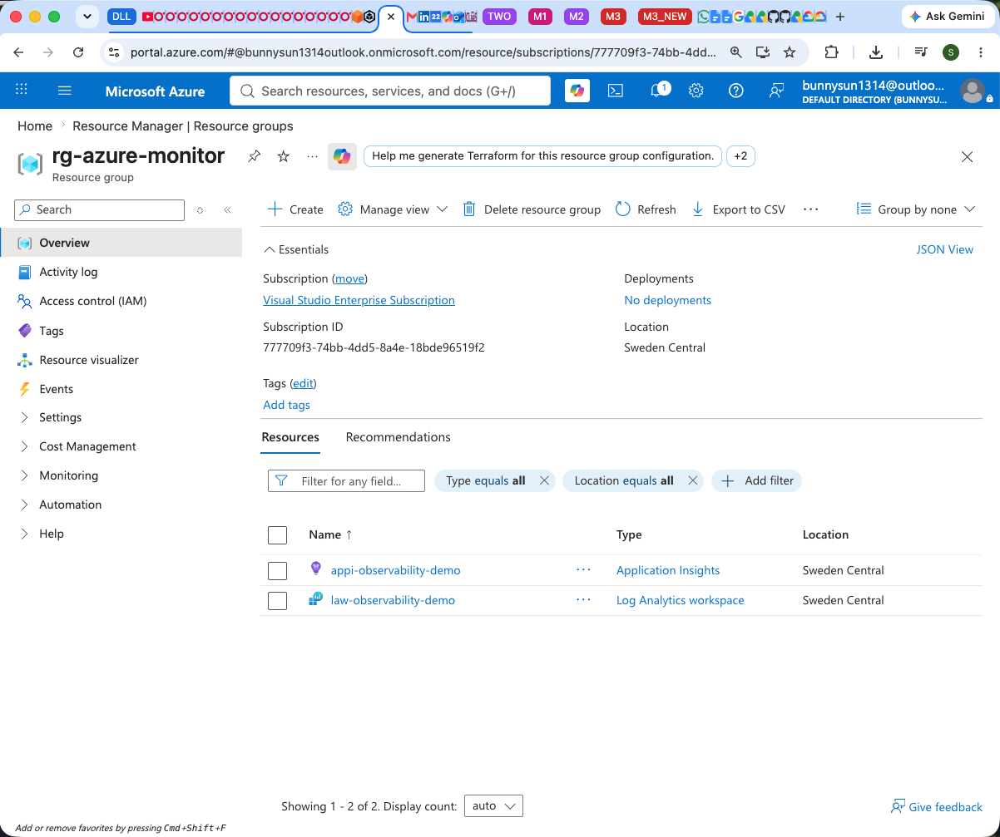
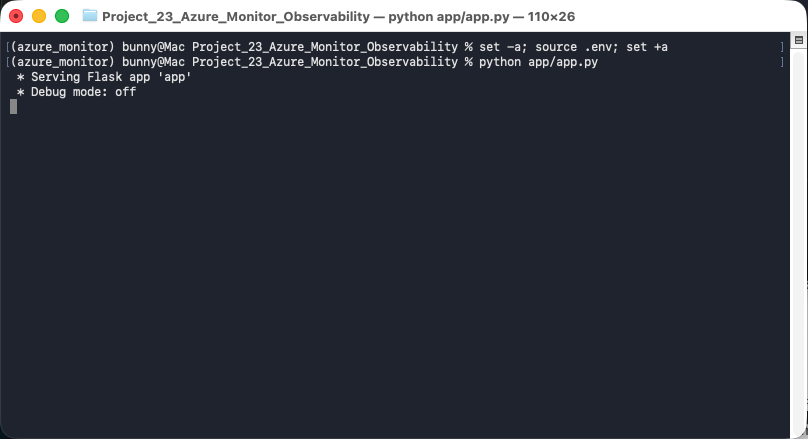
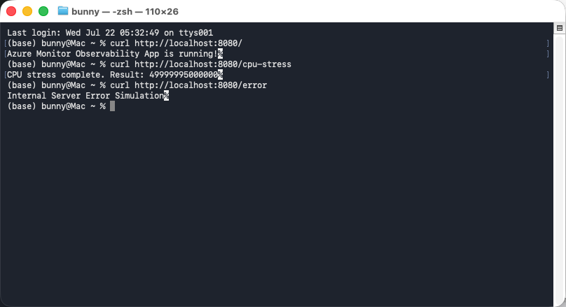
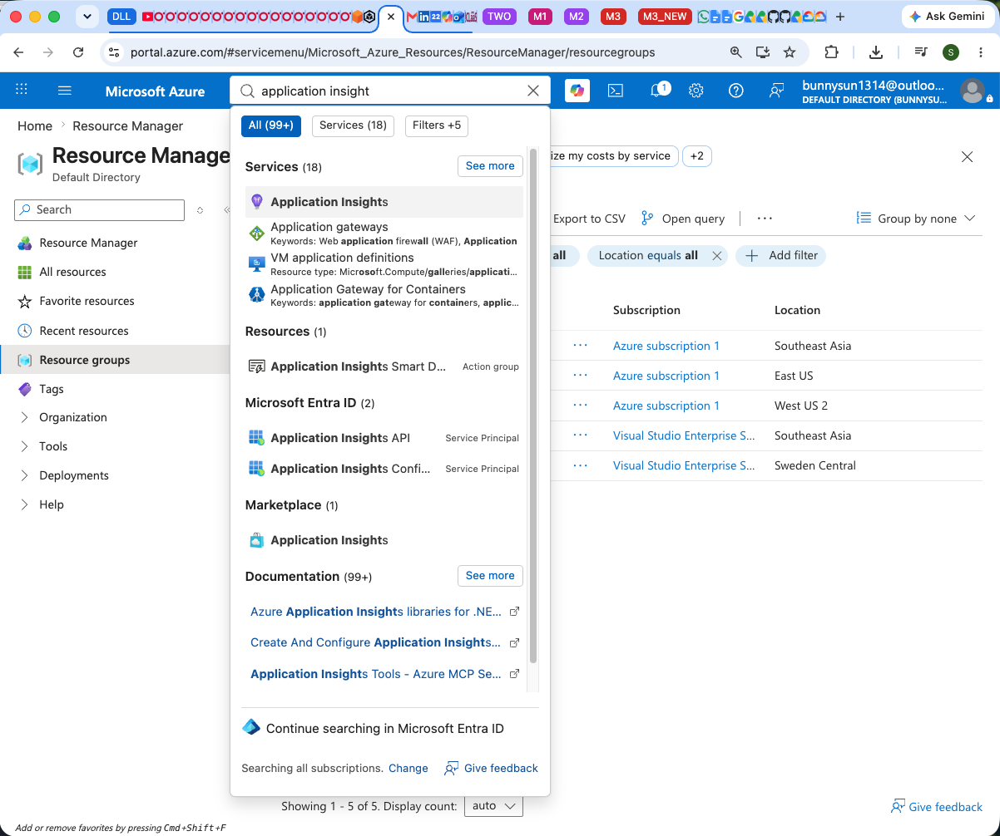
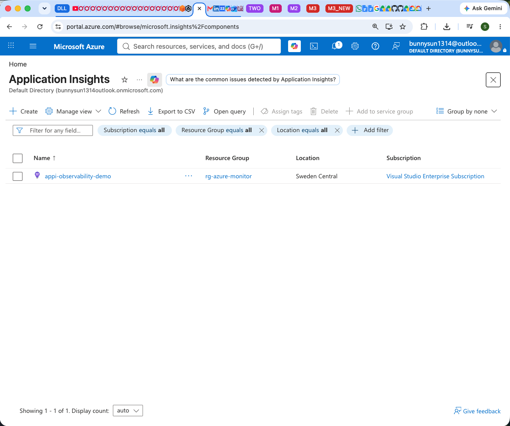
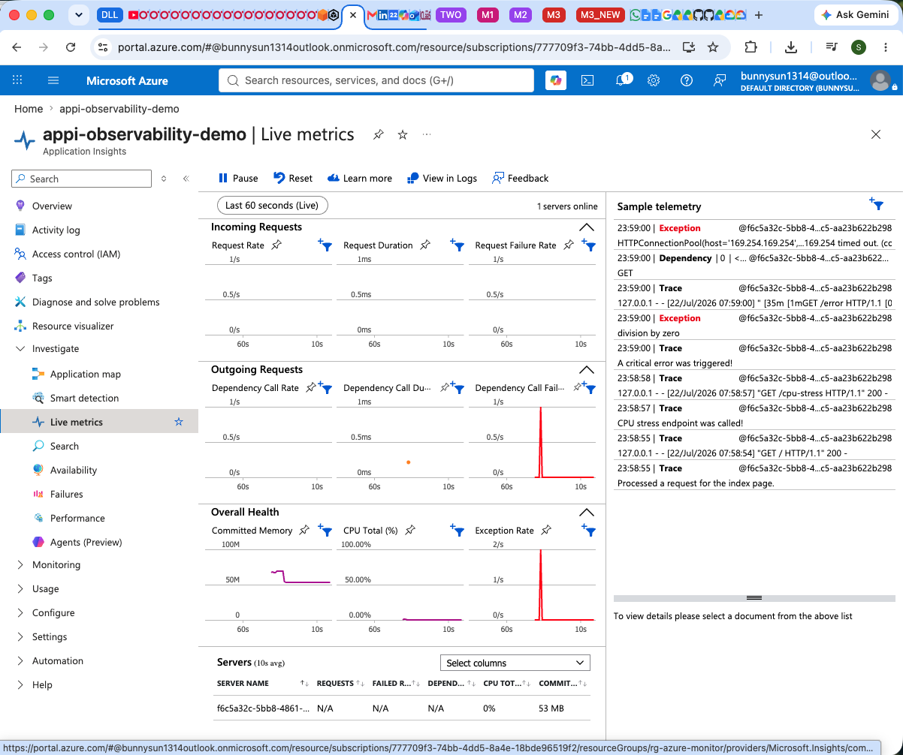
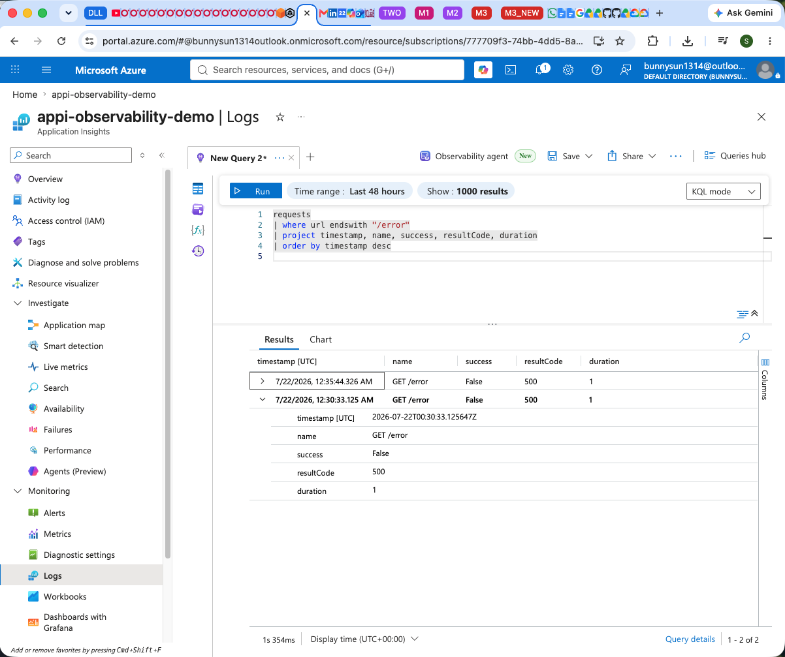
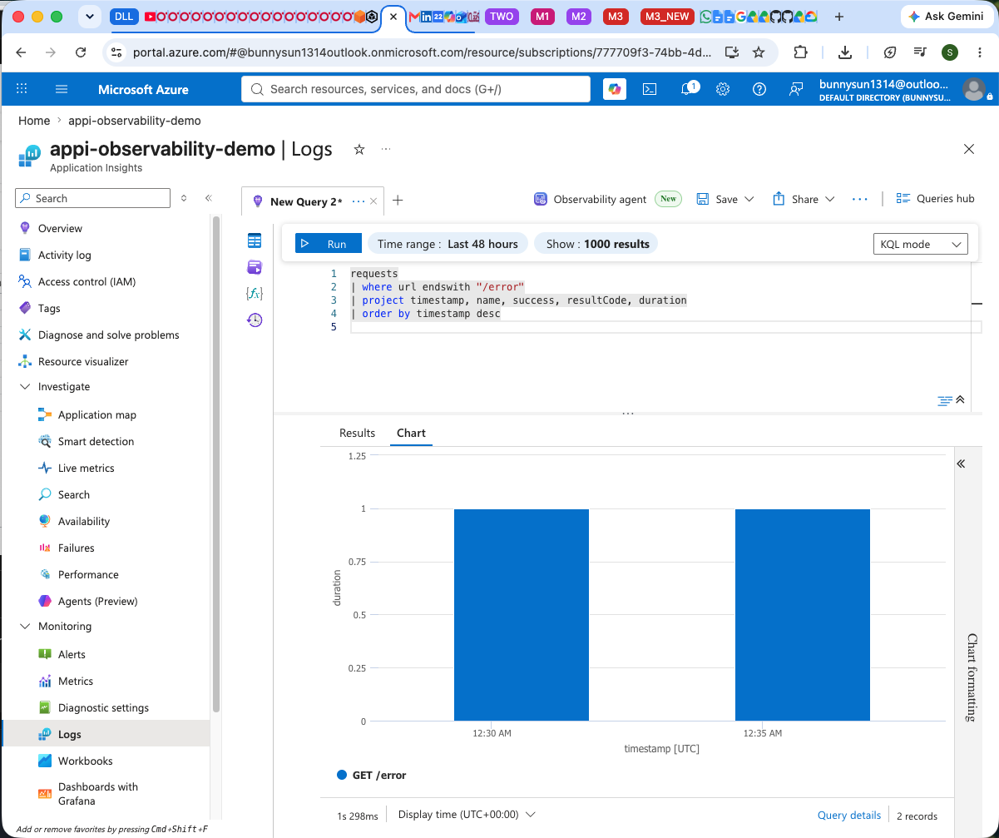

# 🌐 Azure Monitor Observability and Application Insights (OpenTelemetry)

This project demonstrates how to architect and implement an enterprise cloud-native observability pipeline on Microsoft Azure using **Terraform (IaC)**, **Azure Log Analytics Workspace**, and **Azure Application Insights**. It instruments a Python web microservice using the vendor-neutral **Azure Monitor OpenTelemetry Distro** to capture distributed traces, live runtime metrics, service dependency maps, and structured logs, empowering Site Reliability Engineers (SREs) to monitor application health in real time and execute deep root-cause investigations via **Kusto Query Language (KQL)**.

## <span id="toc"></span>📑 Table Of Contents (TOC)

- [0. Pre-requisite Software](#prerequisites)
- [1. Architecture Overview](#overview)
  - [1.1 The "Why": Business & Architectural Rationale](#why-rationale)
  - [1.2 End-to-End Pipeline Workflow & Testing](#pipeline-workflow)
- [2. Directory Structure](#folder-structure)
- [3. Environment Setup](#env-setup)
- [4. Deploy the Infrastructure](#deploy-infra)
- [5. Test the Application & Monitor](#test-deployment)
  - [5.1 Fetch Application Insights Credentials](#fetch-creds)
  - [5.2 Start the Flask Application](#start-app)
  - [5.3 Simulate Traffic & Failure Modes](#simulate-traffic)
  - [5.4 Live Cloud Observability & KQL Analytics](#cloud-observability)
- [6. Clean Up](#cleanup)
- [7. Frequently Asked Questions (FAQ)](FAQ.md)
- [8. Troubleshooting Guide](TROUBLESHOOTING.md)

---

## <span id="prerequisites"></span><span style="color:red">⚙️ 0. Pre-requisite Software</span> <span style="font-size: 14px; font-weight: normal;">[⬆️ Back to TOC](#toc)</span>

Ensure you have the following software installed before proceeding:

- **Anaconda / Miniconda**: Required to manage the Python environments cleanly. Download and install from the [Anaconda Official Website](https://www.anaconda.com/download) or the [Miniconda Website](https://docs.conda.io/en/latest/).

  ```bash
  conda --version
  ```

- **Azure CLI**: To authenticate with your Azure subscription. Download and install from [Azure CLI Official Website](https://learn.microsoft.com/en-us/cli/azure/install-azure-cli).

  ```bash
  az --version
  ```

- **Terraform**: Required to deploy the Azure resources. Download and install from [HashiCorp Official Website](https://developer.hashicorp.com/terraform/downloads).

  ```bash
  terraform --version
  ```

---

## <span id="overview"></span><span style="color:red">🏗️ 1. Architecture Overview</span> <span style="font-size: 14px; font-weight: normal;">[⬆️ Back to TOC](#toc)</span>

### <span id="why-rationale"></span>💡 1.1 The "Why": Business & Architectural Rationale <span style="font-size: 14px; font-weight: normal;">[⬆️ Back to TOC](#toc)</span>

Modern distributed applications generate vast volumes of runtime telemetry. Traditional enterprise monitoring relied on proprietary vendor agents and fragmented log files, leading to three critical operational bottlenecks: **vendor lock-in** (costly application rewrites when changing telemetry providers), **telemetry silos** (disconnected traces, metrics, and logs that hinder root-cause debugging), and **ingestion latency** (batch delays of 2 to 5 minutes that cripple incident response during active production outages).

This architecture addresses these challenges by implementing an open-standard, real-time observability pipeline on Microsoft Azure:

- **Why an APM (Application Performance Monitoring) Pipeline over Traditional Infrastructure Monitoring?** Traditional cloud monitoring only inspects the outer infrastructure shell (is the VM responding to pings, is overall CPU at 80%, or is disk space full). It is completely blind to internal software execution. It cannot tell you why a user's checkout request took 4.2 seconds instead of 200 milliseconds, or which line of Python code threw an unhandled 500 exception. An APM pipeline peers directly inside the application's runtime memory, capturing the three core pillars of observability—**Metrics** (rates and latencies), **Distributed Traces** (request hops across microservice boundaries), and **Structured Logs** (exceptions and stack traces)—and streaming them continuously to the cloud.
- **Why OpenTelemetry (OTel) over Proprietary SDKs?** Legacy Application Insights SDKs used proprietary data models that tightly coupled business logic to Azure. The Azure Monitor OpenTelemetry Distro adheres strictly to the CNCF OpenTelemetry open standard. It provides zero-code automatic instrumentation by monkey-patching Python HTTP libraries in memory, extracting distributed traces and standard W3C Trace Context headers across microservice boundaries without rewriting codebase internals.
- **Why Centralized Log Analytics Workspace over Classic Application Insights?** Classic Application Insights stored data in standalone, isolated repositories with rigid retention policies. Modern Azure architectures mandate workspace-based Application Insights backed by an **Azure Log Analytics Workspace**. This consolidates application traces, virtual machine infrastructure metrics, container logs, and firewall audit trails into a single unified telemetry lake, enabling high-speed multi-resource correlation using Kusto Query Language (KQL).
- **Why Live Metrics Streaming over Standard Telemetry Buffering?** Standard cloud log pipelines buffer, batch, and index telemetry events with an inherent 2 to 5-minute ingestion lag. During critical releases or active incidents, SREs require instant operational feedback. Application Insights Live Metrics establishes an outbound QuickPulse WebSocket connection directly from the SDK, delivering sub-second (1-second refresh) streaming of request rates, error spikes, duration histograms, and CPU/memory utilization.
- **Why Decouple Local App Execution from Cloud Monitoring?** In enterprise development workflows, microservices are developed and tested across varied local runtimes before cloud container deployment. By externalizing the `APPLICATIONINSIGHTS_CONNECTION_STRING` into standard environment variables, local Flask processes stream telemetry directly to Azure without requiring full cloud deployment just to validate telemetry schema compliance.
- **Why Terraform (IaC) for Observability Foundations?** Telemetry retention schedules and daily data caps represent significant cloud cost vectors. Provisioning the Log Analytics Workspace and Application Insights instance through Terraform ensures repeatable, version-controlled governance that prevents unmetered data ingestion and optimizes retention costs across staging and production environments.



### <span id="pipeline-workflow"></span>🧪 1.2 End-to-End Pipeline Workflow & Testing <span style="font-size: 14px; font-weight: normal;">[⬆️ Back to TOC](#toc)</span>

The end-to-end observability workflow executes across four coordinated stages:

1. **Infrastructure Provisioning (Terraform)**: Terraform automates the deployment of a centralized Log Analytics Workspace and links it to an Application Insights component (`appi-observability-demo`), dynamically outputting the cryptographic connection string and regional ingestion endpoint.
2. **SDK Instrumentation & Monkey-Patching (Python Flask)**: The application (`app/app.py`) executes `configure_azure_monitor(enable_live_metrics=True)` before importing web frameworks. The OpenTelemetry SDK intercepts incoming HTTP traffic, collects runtime process metrics, and opens the outbound QuickPulse streaming channel to Azure.
3. **Traffic Generation & Failure Injection (Curl / Browser)**: Controlled synthetic HTTP traffic tests operational resilience across healthy endpoints (`/`), computational CPU stress algorithms (`/cpu-stress`), and deliberately unhandled 500 exceptions (`/error`).
4. **Cloud Observability & KQL Analytics (Azure Portal)**: SREs monitor real-time throughput on the Live Metrics blade, inspect the auto-discovered Application Map dependency topology, and run KQL queries to isolate slow requests and trace unhandled exceptions.

---

## <span id="folder-structure"></span><span style="color:red">📂 2. Directory Structure</span> <span style="font-size: 14px; font-weight: normal;">[⬆️ Back to TOC](#toc)</span>

```text
Project_23_Azure_Monitor_Observability/
├── app/                          # Flask microservice source code
│   └── app.py                    # Web app with OpenTelemetry automatic instrumentation
├── images/                       # Architecture diagrams and documentation assets
│   └── architecture.png          # Azure Monitor & Application Insights architecture
├── terraform/                    # Infrastructure as Code (IaC) configurations
│   ├── main.tf                   # Resource Group, Log Analytics & App Insights
│   ├── outputs.tf                # Connection strings and regional ingestion endpoints
│   └── variables.tf              # Deployment region and resource naming variables
├── .env.example                  # Template for Application Insights connection strings
├── .gitignore                    # Git ignore rules for state files, keys, and environments
├── environment.yml               # Conda environment specification with project dependencies
├── FAQ.md                        # Deep technical explanations, architecture design, and Gotchas
├── README.md                     # Complete project documentation and step-by-step deployment guide
└── TROUBLESHOOTING.md            # Categorized issue resolutions with Before and After code blocks
```

---

## <span id="env-setup"></span><span style="color:red">⚙️ 3. Environment Setup</span> <span style="font-size: 14px; font-weight: normal;">[⬆️ Back to TOC](#toc)</span>

3.1. Create and activate the Conda environment:
```bash
# Ensure you are at the project root before starting
conda env create -f environment.yml
conda activate azure_monitor
```

3.2. Set up your environment variables:
```bash
# Ensure you are at the project root before starting
cp .env.example .env
```

3.3. Log in to Azure using the CLI:
```bash
az login
```

---

## <span id="deploy-infra"></span><span style="color:red">🚀 4. Deploy the Infrastructure</span> <span style="font-size: 14px; font-weight: normal;">[⬆️ Back to TOC](#toc)</span>

Initialize Terraform and deploy the control plane resources:

```bash
# Ensure you are at the project root before starting
cd terraform
terraform init

# Source environment variables before running terraform
set -a; source ../.env; set +a

# rg-azure-monitor
echo ${RESOURCE_GROUP_NAME}
# swedencentral
echo ${LOCATION}

terraform apply -var="resource_group_name=${RESOURCE_GROUP_NAME}" -var="location=${LOCATION}" -auto-approve
```





---

## <span id="test-deployment"></span><span style="color:red">🧪 5. Test the Application & Monitor</span> <span style="font-size: 14px; font-weight: normal;">[⬆️ Back to TOC](#toc)</span>

### <span id="fetch-creds"></span>🔑 5.1 Fetch Application Insights Credentials <span style="font-size: 14px; font-weight: normal;">[⬆️ Back to TOC](#toc)</span>

First, dynamically fetch the connection string outputted by Terraform:
```bash
# Ensure you are at the project root before starting
export APPLICATIONINSIGHTS_CONNECTION_STRING=$(cd terraform && terraform output -raw application_insights_connection_string)

# InstrumentationKey=...;IngestionEndpoint=https://...
echo ${APPLICATIONINSIGHTS_CONNECTION_STRING}
```

**⚠️ IMPORTANT**: Copy the printed connection string from your terminal and paste it into your `.env` file as the value for `APPLICATIONINSIGHTS_CONNECTION_STRING`.

### <span id="start-app"></span>🚀 5.2 Start the Flask Application <span style="font-size: 14px; font-weight: normal;">[⬆️ Back to TOC](#toc)</span>

Start the local Flask application. It will automatically read the `.env` file and begin streaming telemetry to Azure Monitor:

```bash
# Ensure you are at the project root before starting
set -a; source .env; set +a
python app/app.py
```



### <span id="simulate-traffic"></span>⚡ 5.3 Simulate Traffic & Failure Modes <span style="font-size: 14px; font-weight: normal;">[⬆️ Back to TOC](#toc)</span>

Open a new terminal window and use `curl` to hit these endpoints (or open the URLs directly in your web browser):

**1. Normal Traffic:**
```bash
curl http://localhost:8080/
```

**2. CPU Stress Test:**
```bash
curl http://localhost:8080/cpu-stress
```

**3. Error Simulation:**
```bash
curl http://localhost:8080/error
```



### <span id="cloud-observability"></span>📊 5.4 Live Cloud Observability & KQL Analytics <span style="font-size: 14px; font-weight: normal;">[⬆️ Back to TOC](#toc)</span>

1. Open the [Azure Portal](https://portal.azure.com/).
2. Navigate to your Application Insights resource (`appi-observability-demo`).

    

    

3. Click on **Live Metrics** to see the traffic in real-time as you hit the endpoints!

    

4. Click on **Application Map** to see the auto-generated topology map.

    

5. Click on **Logs** (under Monitoring in the left menu). Close the default queries pop-up, and you can write custom **KQL (Kusto Query Language)** queries to analyze your telemetry! For example, to find all requests that hit the `/error` endpoint, paste this in and click Run:
    ```kusto
    requests
    | where url endswith "/error"
    | project timestamp, name, success, resultCode, duration
    | order by timestamp desc
    ```

    📝 Note: Remember to switch to `KQL mode` (Dropdown list at the top-right corner) before you can type the above query.

    

    

---

## <span id="cleanup"></span><span style="color:red">🧹 6. Clean Up</span> <span style="font-size: 14px; font-weight: normal;">[⬆️ Back to TOC](#toc)</span>

After you finish experimenting, stop the Python app (CTRL+C) and destroy the infrastructure to prevent unwanted charges.

```bash
# Ensure you are at the project root before starting
cd terraform

# Source environment variables before running terraform
set -a; source ../.env; set +a

# rg-azure-monitor
echo ${RESOURCE_GROUP_NAME}
# swedencentral
echo ${LOCATION}

terraform destroy -var="resource_group_name=${RESOURCE_GROUP_NAME}" -var="location=${LOCATION}" -auto-approve
```
