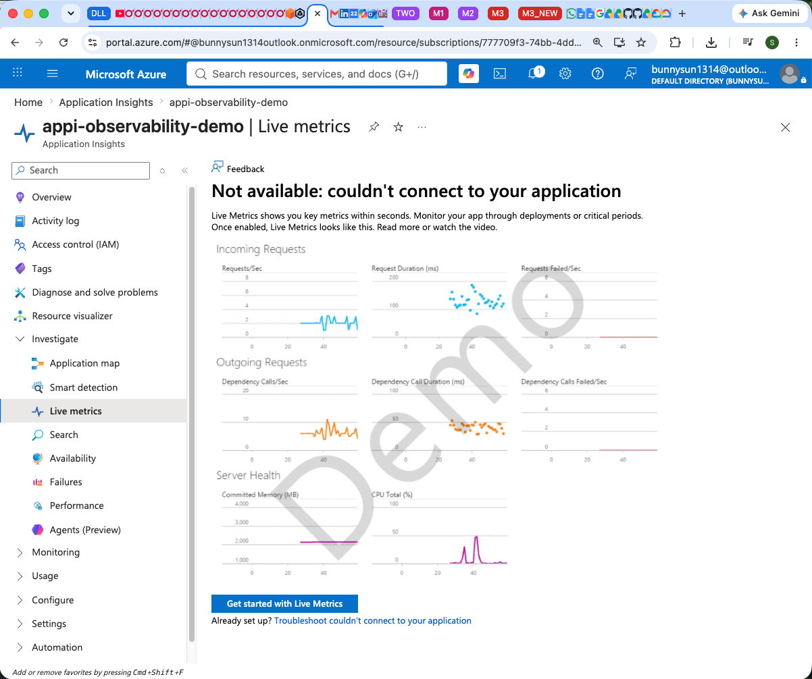

# <span style="color:red">🛠️ 8. Troubleshooting Guide</span> <span style="font-size: 14px; font-weight: normal;">[⬆️ Back to TOC](README.md#toc)</span>

## 🛠️ 8.1 Missing Connection String

❌ Error: `ValueError: Connection string cannot be empty or null.`

**Symptom:**
When starting `app.py`, the application crashes immediately with a ValueError regarding the connection string.

**Solution:**
Ensure you have copied the `application_insights_connection_string` from the Terraform output and placed it correctly into your `.env` file at the root of the project. Also ensure you are sourcing the `.env` file before running the app.

**Before (Code causing the error in `.env`)**
```text
APPLICATIONINSIGHTS_CONNECTION_STRING=""
```

**After (Corrected code)**
```text
APPLICATIONINSIGHTS_CONNECTION_STRING="InstrumentationKey=1234abcd;IngestionEndpoint=https://eastus-0.in.applicationinsights.azure.com/"
```

---

## 🛠️ 8.2 Missing OpenTelemetry Packages

❌ Error: `ModuleNotFoundError: No module named 'azure.monitor.opentelemetry'`

**Symptom:**
When starting the application, Python complains that it cannot find the Azure Monitor package.

**Solution:**
You likely forgot to activate the Conda environment or the installation failed. Activate the environment and install the required dependencies.

**Before (Code causing the error in terminal)**
```bash
python app/app.py
```

**After (Corrected code)**
```bash
conda activate azure_monitor
python app/app.py
```

---

## 🛠️ 8.3 Terraform Resource Group Deletion Error

❌ Error: `Error: deleting Resource Group "...": the Resource Group still contains Resources.`

**Symptom:**
When running `terraform destroy`, Terraform fails to delete the Resource Group. The error message indicates that the Resource Group still contains nested resources (like `Application Insights Smart Detection`).

**Solution:**
When you deploy Application Insights, Azure secretly auto-injects hidden "Smart Detection" resources into the Resource Group. Because Terraform didn't explicitly create them, it fails its safety check during deletion. You must disable this safety check in the AzureRM provider `features` block so Terraform is allowed to forcibly delete the Resource Group regardless of any secret resources Azure added.

**Before (Code causing the error in `terraform/main.tf`)**
```hcl
provider "azurerm" {
  features {}
}
```

**After (Corrected code)**
```hcl
provider "azurerm" {
  features {
    resource_group {
      prevent_deletion_if_contains_resources = false
    }
  }
}
```

---

## 🛠️ 8.4 Missing pkg_resources Module

❌ Error: `ModuleNotFoundError: No module named 'pkg_resources'`

**Symptom:**
When running the Python app, you encounter a traceback pointing to `azure.monitor.opentelemetry._configure.py` crashing due to a missing `pkg_resources` module.

**Solution:**
The `pkg_resources` module is part of the Python `setuptools` package. Modern lightweight Python environments (especially newer Conda/pip versions) sometimes omit `setuptools` by default. You need to explicitly install `setuptools` via your `environment.yml` or pip.

**Before (Code causing the error in `environment.yml`)**
```yaml
  - pip:
      - Flask==3.0.3
      - azure-monitor-opentelemetry==1.4.2
```

**After (Corrected code)**
```yaml
  - pip:
      - setuptools==69.5.1
      - Flask==3.0.3
      - azure-monitor-opentelemetry==1.4.2
```

---

## 🛠️ 8.5 Port 5000 Already in Use (macOS AirPlay)

❌ Error: `Address already in use. Port 5000 is in use by another program.`

**Symptom:**
When starting the Flask application via `python app/app.py`, it crashes immediately complaining that port 5000 is already in use.

**Solution:**
On modern macOS versions (Monterey and later), the 'AirPlay Receiver' service runs continuously in the background on port 5000. You must either disable this setting in your macOS System Preferences, or change the Flask application to run on a different port (like 8080).

**Before (Code causing the error in `app/app.py`)**
```python
    app.run(host="0.0.0.0", port=5000)
```

**After (Corrected code)**
```python
    app.run(host="0.0.0.0", port=8080)
```

---

## 🛠️ 8.6 Live Metrics: Couldn't connect to your application

❌ Error: `Not available: couldn't connect to your application`

**Symptom:**
When viewing the Live Metrics blade in the Azure Portal, the graphs remain grayed out and display the "couldn't connect" message, even though your Flask app is running.



**Solution:**
There are four common reasons for this:
1. **Missing Connection String**: Your terminal session where you ran `python app.py` doesn't actually have the `.env` variables loaded. Stop the app (CTRL+C), ensure you run `set -a; source .env; set +a`, and then restart the app.
2. **Explicit Enablement**: While newer OpenTelemetry SDKs enable Live Metrics by default, it is always safest to explicitly pass `enable_live_metrics=True` into `configure_azure_monitor()`. 
3. **No Traffic Yet**: Live Metrics sometimes needs a "wakeup ping". Run one of the `curl http://localhost:8080/` commands in your terminal to force the SDK to establish the connection stream!
4. **Outdated SDK Version**: Live Metrics for Python was only introduced in `azure-monitor-opentelemetry` version `1.6.0+`. If your `environment.yml` pins an older version (like `1.4.2`), the `enable_live_metrics=True` command will be completely ignored! You must upgrade the package to `1.8.9` or newer.

**Before (Code causing the error in `app/app.py`)**
```python
configure_azure_monitor()
```

**After (Corrected code)**
```python
configure_azure_monitor(
    enable_live_metrics=True
)
```

**Before (Code causing the error in `environment.yml`)**
```yaml
  - pip:
      - setuptools==69.5.1
      - Flask==3.0.3
      - azure-monitor-opentelemetry==1.4.2
```

**After (Corrected code)**
```yaml
  - pip:
      - setuptools==69.5.1
      - Flask==3.0.3
      - azure-monitor-opentelemetry==1.8.9
```

---

## 🛠️ 8.7 Missing HTTP Requests (Python Import Order)

❌ Error: `No HTTP Requests logged in Azure (Requests table is empty)`

**Symptom:**
Custom metrics and external dependency pings successfully appear in Azure Log Analytics and Live Metrics, but your incoming HTTP requests (like hitting `/error` via curl) are completely missing from the `requests` table.

**Solution:**
OpenTelemetry Auto-Instrumentation works by "monkey-patching" the global `flask` library in Python's memory to intercept HTTP routes. If you import `Flask` into your local file before you call `configure_azure_monitor()`, you create a strict local reference to the original, un-patched Flask code. The SDK will successfully configure itself in the background, but your app will completely bypass the tracking mechanisms! You must configure the Azure Monitor OpenTelemetry SDK before importing your web framework.

**Before (Code causing the error in `app/app.py`)**
```python
from flask import Flask, request
from azure.monitor.opentelemetry import configure_azure_monitor

# The SDK patches Flask here, but the local reference above remains un-patched!
configure_azure_monitor(enable_live_metrics=True)

app = Flask(__name__)
```

**After (Corrected code)**
```python
from azure.monitor.opentelemetry import configure_azure_monitor

# Configure SDK first so it patches the global sys.modules
configure_azure_monitor(enable_live_metrics=True)

# Import Flask AFTER configuration to get the patched version
from flask import Flask, request

app = Flask(__name__)
```

**Diagnostic Process (The KQL Detective Work):**
This bug is a "silent failure," meaning the app doesn't crash, but it secretly fails its primary objective. To isolate this specific bug, you can use KQL in the Azure Portal to perform "detective work" across your data tables:

1. Run `customMetrics | count`
    - **If > 0:** This proves your app is successfully connecting and authenticating to Azure. The API key and network are 100% working.
2. Run `dependencies | count`
    - **If > 0:** This proves the OpenTelemetry SDK successfully initialized and is automatically tracking outgoing background calls (like Azure's internal `169.254.169.254` IMDS pings).
3. Run `requests | count`
    - **If 0:** If you hit your Flask endpoints with `curl` but this table is completely empty (while the other two tables are full), this uniquely isolates the bug! It proves the cloud configuration is perfect, but the local auto-instrumentation hook for Flask completely failed to attach, pinpointing a local Python initialization issue (the import order)!
